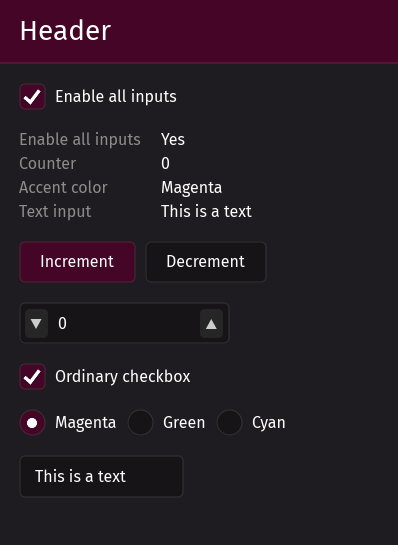
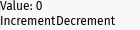
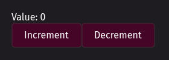
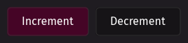
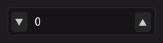
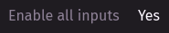
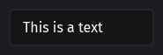

# Floem UI Kit

Want a pretty Rust GUI with minimal time investment? Use a kit of premade UI components! Floem UI Kit provides polished widgets you can use in conjunction with the [Floem](https://github.com/lapce/floem) GUI library.

- ✅ Supports all major desktop operating systems
- ✅ All widgets implement hover, focus and disabled state
- ✅ All widgets provide keyboard access
- ✅ Supports multiple accent colors



⚠️ **Floem UI Kit, like Floem, is experimental software.** ⚠️

## Installation

Since Floem does not have a published release, you can install it as a Git dependency:

```toml
floem = { git = "https://github.com/lapce/floem", rev = "e795021bfb28cd15a6d499349e547c435ceb8520" }
```

Crates.io does not allow Git dependencies, so Floem UI Kit is not available on crates.io yet. When Floem publishes to crates.io, Floem UI Kit will publish as well. In the meantime, you can install Floem UI Kit as a Git dependency.

## First time using Floem?

Floem's documentation is available [here](http://lapce.dev/floem/floem/). You might notice that it incorporates familiar concepts from other UI frameworks, including:

- Interface composition using nestable horizontal and vertical widget containers
- A styling system that brings many CSS-like features to Rust, without the overhead of a browser runtime
- Reactivity using signals, as seen in frameworks like [SolidJS](https://www.solidjs.com/)
- Implementation of UIs using functions, similar to Jetpack Compose

For a mimimal example involving a counter that can be incremented/decremented, have a look at [this file](examples/counter_floem/src/main.rs). It looks quite basic when rendered:



If you've familiarized yourself with the Floem's basics, keep reading to find out how to spice things up.

## Getting started with Floem UI Kit

The Floem UI Kit workflow involves:

1. Creating an instance of [`floem_ui_kit::theme::Theme`](https://docs.rs/floem-ui-kit/latest/floem_ui_kit/theme/struct.Theme.html). `Theme::default()` creates an instance with default settings.
2. Using the widget creation methods in `Theme` to build your UI. If Floem UI Kit doesn't have exactly what you want, you can mix and match with self-written UI components. You can keep using Floem's `v_stack` and `h_stack` methods to lay out your components.
3. Wrapping your window contents in Floem UI Kit's padded container to ensure your widgets don't stick to the side of the window.
4. Wrapping the padded container in Floem UI Kit's root view to apply the theme to the entire window.

[Over here](examples/counter_uikit/src/main.rs) you'll find the above example ported to Floem UI Kit. Here is a reference render:



These components are still sticking to one another. You'll probably want to add a small gap between them. `v_stack` and `h_stack` can automatically add those gaps, provided that you request it:

```rust
v_stack(/* .. */)
	.style(|s| s.gap(0.0, 10.0))
```

The above will add no horizontal gap and a vertical 10-pixel gap.

## Supported widgets

For more information on how to use these, see the [code docs](https://docs.rs/floem-ui-kit/latest/floem_ui_kit/theme/struct.Theme.html#implementations).

| **Widget**                        | **Preview**                                  |
| --------------------------------- | -------------------------------------------- |
| Button _(multiple variants)_      |                |
| Checkbox                          |            |
| Integer input (spinbox)           |  |
| Label _(multiple variants)_       |                  |
| Radio group _(multiple variants)_ |      |
| Simple header                     |  |
| Text input                        |        |

For an example incorporating all available widgets, [see here](examples/showcase/src/main.rs). It's the source code for the screenshot at the top of the README.

## Not quite what you're looking for?

I'm not aware of any other Floem UI component libraries right now.

As far as Rust UI libraries go, [Iced](https://iced.rs/) is a well-known one. Device manufacturer System76 is using it to implement its own desktop environment. You might be able to build onto their work by checking out [libcosmic](https://github.com/pop-os/libcosmic). Be advised that its learning curve may be a bit steeper than Floem's, and that the library is primarily intended for use by applications that are native to the Cosmic desktop environment.

If you're willing to consider Electron-like solutions that are not completely native and may have a larger resource footprint, I'd definitely check out [Tauri](https://tauri.app/). Since it's built on HTML/JS/CSS, you can use it with any web-based UI framework.

And finally, [Are we GUI yet?](https://areweguiyet.com/) is a big collection of GUI-related tools.
